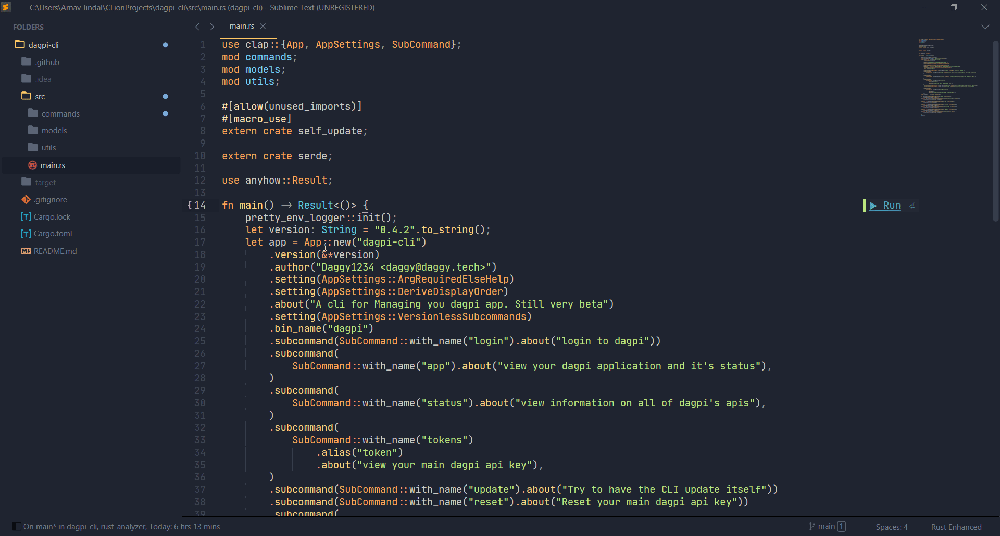

# LSP-rust-analyzer

This is a helper package that starts the [rust-analyzer](https://github.com/rust-analyzer/rust-analyzer) language server for you.

## Installation

1. Install [LSP](https://packagecontrol.io/packages/LSP) via Package Control.
2. Install [LSP-rust-analyzer](https://packagecontrol.io/packages/LSP-rust-analyzer) via Package Control.
3. (Recommended) Install the [LSP-file-watcher-chokidar](https://github.com/sublimelsp/LSP-file-watcher-chokidar) via Package Control to enable functionality to notify the server about changed files.

## Configuration

You can edit the global settings by opening the `Preferences: LSP-rust-analyzer Settings` from the Command Palette.

You can also have a project-specific configuration. Run the `Project: Edit Project` from the Command Palette and edit the following in the `settings` object.

```js
{
    // folders: [
    //   ...
    // ]
    "settings": {
        "LSP": {
            "rust-analyzer": {
                "settings": {
                    //Setting-here
                }
            }
        }
    }
}
```

## Applicable Selectors

This language server operates on views with the `source.rust` base scope.

## Installation Location

The server binary is automatically downloaded to `$CACHE/Package Storage/LSP-rust-analyzer`.

## Custom Command Palette Commands

### LSP-rust-analyzer: Run...

Select a cargo command from the submenu. This spawns a shell with [Terminus](https://packagecontrol.io/packages/Terminus) for tests, checks and executing code.

> Note: The [Terminus](https://packagecontrol.io/packages/Terminus) package needs to be installed for this functionality.



### LSP-rust-analyzer: Join Lines

Joins lines accounting for rust-specific logic.

Also bound to the default join-lines key binding (<kbd>ctrl</kbd><kbd>shift</kbd><kbd>j</kbd> or <kbd>command</kbd><kbd>shift</kbd><kbd>j</kbd> on Windows/Linux and Mac respectively).

### LSP-rust-analyzer: Open Docs Under Cursor

Opens the URL to documentation for the symbol under the cursor, if available.

### LSP-rust-analyzer: Reload Project

Reloads the project metadata, i.e. runs `cargo metadata` again.

### LSP-rust-analyzer: Expand Macro Recursively

Shows the full macro expansion of the macro at current cursor.
